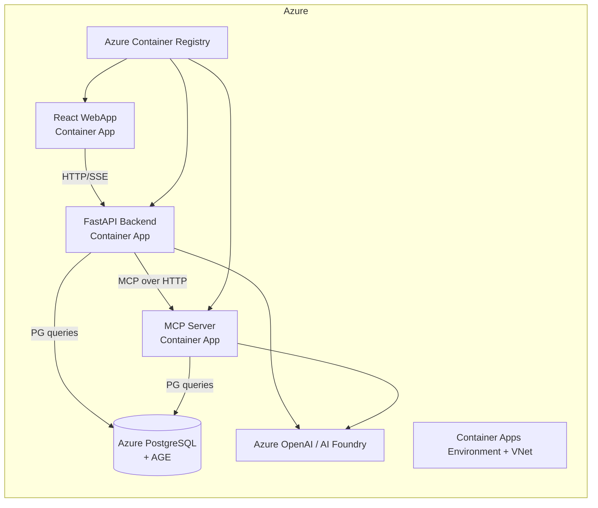

# Agent Framework WebApp: Knowledge Graph on PostgreSQL AGE (Azure)

This repository demonstrates an end-to-end **knowledge graph application** built on **PostgreSQL + Apache AGE**, with AI agent orchestration and a web UI.  
All major components are designed to run locally and be containerized/deployed to **Azure Container Apps** through `azd` + Bicep.

## What this project does

- Models customer/business data as a graph in PostgreSQL AGE.
- Exposes graph and agent capabilities through:
  - an **MCP server** (`mcp_server`) for graph/tool access,
  - a **FastAPI backend** (`af_fastapi`) for API + orchestration,
  - a **React web app** (`webapp`) for user interaction.
- Provisions cloud infrastructure (VNet, ACR, PostgreSQL, Container Apps, AI resources) with `azd_deploy`.

## High-level architecture



## Repository structure

- `af_fastapi/` — FastAPI service, orchestration workflows, AGE graph helpers
- `mcp_server/` — MCP services (AGE-focused and additional tool servers)
- `webapp/` — React + TypeScript + Vite frontend
- `postgresql_age/` — AGE setup SQL/scripts, graph data tooling, sample datasets
- `azd_deploy/` — Azure deployment project (`azure.yaml`, Bicep modules, hooks)
- `run.ps1` — local multi-process launcher (MCP + FastAPI + Web UI)

## Core services and ports

### 1) MCP server (`mcp_server`)
- Main graph MCP server: `age_mcp_server.py`
- Default transport: `streamable-http`
- Expected port (local): `3002`

### 2) FastAPI backend (`af_fastapi`)
Key endpoints in `af_fastapi.py` include:
- `GET /health`
- `GET /events` (SSE)
- `POST /conversation/{user_id}` (NDJSON streaming responses)
- `POST /nodes`
- `POST /edges`
- `GET /nodes`
- `GET /nodes/{node_id}/all_edges`

Default local port: `8080`.

### 3) Web app (`webapp`)
- React app built with Vite
- Dev server started via `npm run dev`
- Uses backend endpoints through configured API base URL

## Local development

## Prerequisites

- Windows PowerShell (repo includes `run.ps1`)
- Python 3.12+
- `uv` (Python package manager)
- Node.js 20+
- PostgreSQL (or Azure PostgreSQL) configured for AGE

## Quick start (local)

From repo root:

```powershell
./run.ps1
```

This script:
1. Syncs Python dependencies with `uv`
2. Starts AGE MCP server (`mcp_server`, port `3002`)
3. Starts FastAPI backend (`af_fastapi`, port `8080`)
4. Starts web frontend (`webapp`)

## Environment configuration

Use `.env.sample` files as templates and copy to `.env` per component.

Examples:
- `mcp_server/.env.sample`
- `af_fastapi/.env.sample`
- `postgresql_age/.env.sample`

Do **not** commit real secrets in `.env` files.

## Azure deployment (`azd_deploy`)

Deployment is managed by Azure Developer CLI (`azd`) and Bicep templates.

### Infrastructure deployed

- Azure resource group
- Virtual network + subnets
- Azure Container Registry (ACR)
- Azure PostgreSQL Flexible Server (AGE-related config parameters)
- Container Apps Environment
- Container Apps:
  - MCP server app
  - FastAPI backend app
  - Web app
- Azure AI resources (AI Services / model deployment per parameters)

### Deploy

```powershell
cd azd_deploy
azd up
```

or for reprovisioning:

```powershell
azd provision --no-prompt
```

### Deployment sequencing

Post-provision hooks perform phased app deployment in order:
1. MCP server app
2. FastAPI app
3. Web app

This sequencing is controlled by deployment flags in:
- `azd_deploy/infra/main.parameters.json`
- `azd_deploy/infra/main.bicep`

## Important current behavior (AGE/data load)

The post-provision hooks are currently set to **provisioning-only mode** for DB initialization:
- PostgreSQL AGE initialization is skipped
- Graph data loading is skipped

This was done to avoid blocking infrastructure deployment when DB startup/connectivity is unstable.

If you want DB init/data load back in deployment flow, adjust:
- `azd_deploy/hooks/postprovision.ps1`
- `azd_deploy/hooks/postprovision.sh`

## Data and graph tooling

`postgresql_age/` contains:
- AGE setup SQL (`age_setup/`)
- Graph bulk generation/loading utilities (`load_data/`)
- Sample JSON datasets and graph export artifacts
- Standalone Bicep example for PostgreSQL + AGE setup (`postgresql_age/bicep/`)

## Security and repository hygiene

- Keep all credentials in `.env` (ignored) and only commit `.env.sample`.
- Avoid committing `__pycache__`, `.pyc`, and large generated files.
- For large data artifacts, prefer external storage or Git LFS.

## Troubleshooting

### `azd provision` fails during postprovision
- Re-run with:
  ```powershell
  cd azd_deploy
  azd provision --no-prompt
  ```
- Inspect hook scripts:
  - `azd_deploy/hooks/postprovision.ps1`
  - `azd_deploy/hooks/postprovision.sh`

### GitHub push blocked by secrets
- Remove secret from tracked files/history.
- Ensure `.env` and cache files are untracked.
- Regenerate `.env.sample` with blank values.

## Related docs in repo

- Azure deployment README: `azd_deploy/README.md`
- PostgreSQL AGE Bicep notes: `postgresql_age/bicep/README.md`
- Frontend starter notes: `webapp/README.md`

---

If you want, this README can be extended with:
- a request/response API section with payload examples,
- a dedicated AGE schema/data model section,
- a CI/CD pipeline section for automated Azure deployments.
