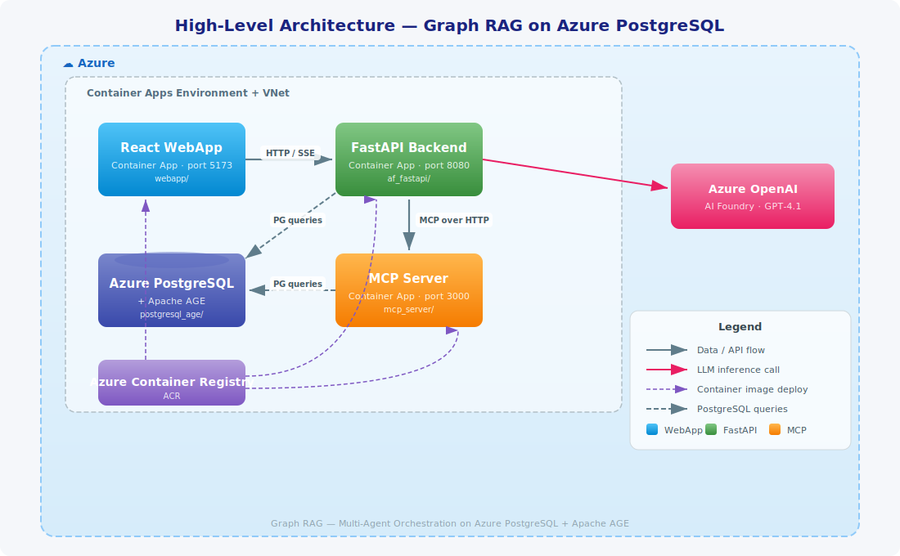
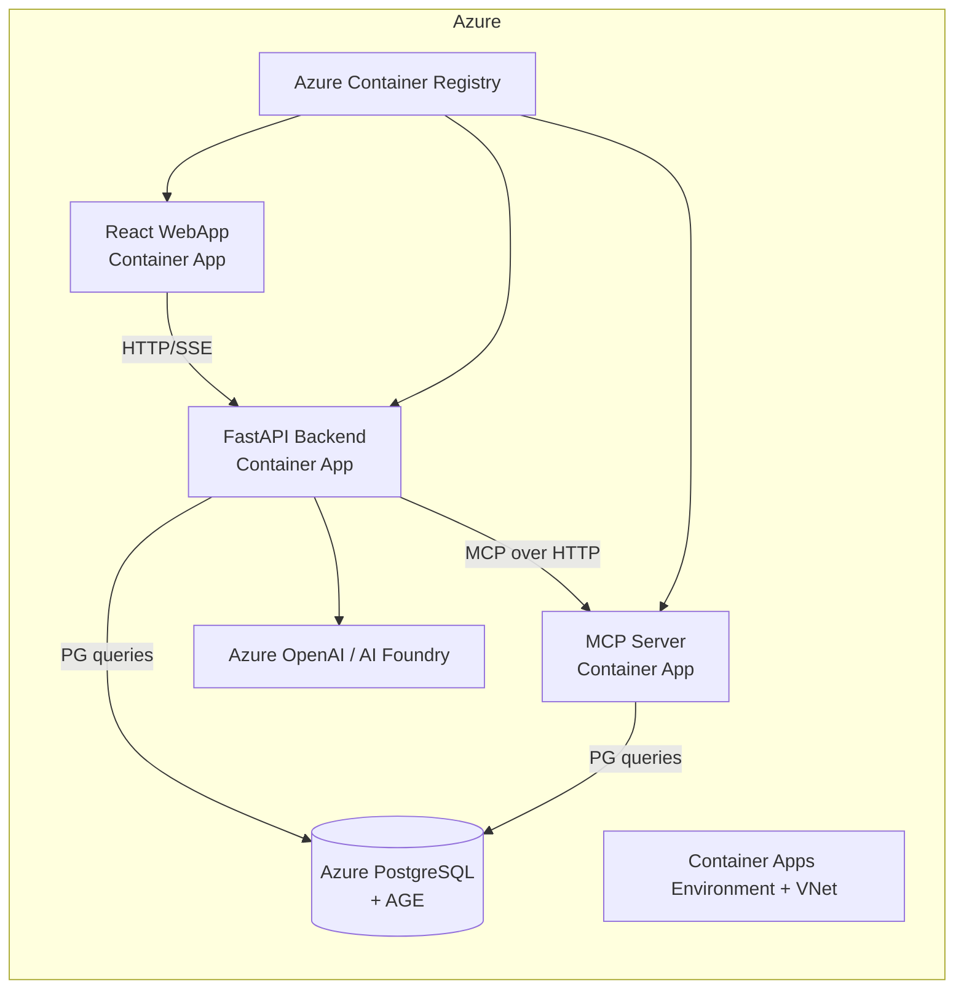

# Beyond Vector Search: Building Production Graph RAG with Multi-Agent Orchestration on Azure PostgreSQL

## Overview

Retrieval-Augmented Generation (RAG) has become the standard approach for grounding LLM responses in enterprise data. The dominant paradigm today—vector similarity search over chunked documents—works well for single-entity lookups but fundamentally breaks down when users ask questions that require **traversing relationships**, **comparing entities**, or **aggregating across connected data**:

- *"Which customers adopted Product X and also have open escalated support cases?"* — requires joining across customer, product, and support-case entities.
- *"Who attended the Board of Library Trustees meeting on March 4, 2024?"* — requires precise property filtering across meeting, attendee, and committee nodes.
- *"Compare Customer 080 and Customer 067 on revenue and product adoption"* — requires parallel traversal of two subgraphs.

This repository implements a production-ready **Graph RAG** system that:

1. Adds graph query capability to **Azure PostgreSQL** using the **Apache AGE** extension—no dedicated graph database required.
2. Solves the unreliable LLM-to-Cypher generation problem with a **multi-agent Generator→Validator→Executor pipeline** built on the **Microsoft Agent Framework** (Magentic One orchestration pattern).
3. Exposes the entire graph query interface as an **MCP server** (Model Context Protocol, streamable HTTP), making it portable across agent frameworks and LLM clients.
4. Implements **domain-agnostic graph modeling** where agents discover ontology at runtime rather than relying on hardcoded schemas.

### Why Graph RAG?

Enterprise users increasingly rely on AI-powered assistants to answer complex, relationship-rich questions. When these systems fail on multi-hop queries—returning incomplete or incorrect answers because the underlying retrieval cannot traverse entity boundaries—users lose trust. Solving relationship-aware retrieval is a prerequisite for making AI assistants genuinely useful in domains where entities are connected: CRM, support, compliance, supply chain, and organizational knowledge.

| Query Category | Example | Vector RAG | Graph RAG |
|---|---|---|---|
| Single-entity lookup | "What products does Customer 080 use?" | Comparable | Comparable |
| Multi-hop relationship | "Customers who adopted Product X with open escalated cases" | Fails — cannot join across chunks | **Succeeds** — edge traversal |
| Comparison | "Compare Customer 080 and 067 on revenue and adoption" | Partial — retrieves one entity well | **Succeeds** — parallel traversal |
| Aggregation | "SLA breach rate for Customer 080" | Fails — no numeric aggregation | **Succeeds** — Cypher aggregation |
| Temporal + entity | "Who attended meeting X on date Y?" | Partial — may retrieve wrong meeting | **Succeeds** — precise property filters |

### Multi-Agent Cypher Generation Pipeline

Single-shot LLM-to-Cypher generation is unreliable. GPT-4.1 produces syntactically invalid or semantically incorrect Apache AGE Cypher queries 40–60% of the time on first attempt due to AGE-specific dialect divergences from Neo4j. The system uses a **Generator→Validator→Executor** pipeline:

1. **Cypher Query Generation Agent** — Receives the user's natural language question and graph name. Performs schema discovery against the live graph by sampling nodes and probing edges. Produces a SQL-wrapped Cypher query grounded in actual property names and relationship types.
2. **Cypher Query Validation Agent** — Validates the generated query against AGE-specific constraints: strips incompatible constructs, verifies `RETURN`/`AS` column-count alignment, checks for forbidden syntax. Executes the query via an MCP tool call and returns structured status (`PASS` / `FAIL` / `LOW_CONFIDENCE_ZERO`).
3. **Orchestration Manager (Magentic One)** — Coordinates the pipeline with anti-loop rules: maximum round counts, stall detection, and mandatory constraint preservation during retry.

---

## High-level architecture



<details>
<summary>Mermaid source (click to expand)</summary>


```mermaid
flowchart LR
    UI[React WebApp\nContainer App] -->|HTTP/SSE| API[FastAPI Backend\nContainer App]
    API -->|MCP over HTTP| MCP[MCP Server\nContainer App]
    API -->|PG queries| PG[(Azure PostgreSQL\n+ AGE)]
    MCP -->|PG queries| PG

    subgraph Azure
      UI
      API
      MCP
      PG
      ACR[Azure Container Registry]
      AI[Azure OpenAI / AI Foundry]
      ENV[Container Apps Environment + VNet]
    end

    ACR --> UI
    ACR --> API
    ACR --> MCP
    API --> AI
```
</details>

---

## Graph Ontologies

The system ships with two demonstration graph domains loaded into PostgreSQL AGE. Agents discover ontology at runtime via `fetch_ontology()` / `save_ontology()` MCP tool calls, so no prompt modifications are needed when onboarding new graphs—just load data into a new AGE graph.

### Customer CRM Graph (`customer_graph`)

A synthetic enterprise CRM graph with 10 node types, 10 relationship types, and ~25,000 total nodes + edges.

**Node types:**

| Node Type | Key Properties | Description |
|---|---|---|
| `Customer` | `id`, `name`, `segment`, `owner`, `products_adopted`, `satisfaction_score`, `health`, `growth_potential`, `current_arr`, `current_mrr`, `timezone` | Customer account |
| `Product` | `name` | Products available for adoption |
| `Feature` | `name` | Product features (Dashboards, Workflows, API, SSO, etc.) |
| `Contract` | `id`, `customer_id`, `start_date`, `end_date`, `amount`, `status`, `auto_renew`, `renewal_term_months` | Customer contracts |
| `Opportunity` | `id`, `customer_id`, `opp_type`, `product`, `stage`, `amount`, `opened_at`, `expected_close` | Sales opportunities |
| `SupportCase` | `id`, `customer_id`, `opened_at`, `status`, `priority`, `escalation_level`, `sla_breached`, `product_area`, `subject` | Support tickets |
| `Communication` | `id`, `customer_id`, `timestamp`, `channel`, `counterpart`, `direction`, `sentiment`, `summary` | Customer communications |
| `TelemetryMonth` | `customer_id`, `month`, `dau`, `mau`, `feature_adoption`, `usage_hours`, `incidents` | Monthly usage telemetry |
| `QBRArtifact` | `customer_id`, `report_period`, `highlights`, `risks`, `asks` | Quarterly Business Review artifacts |
| `SalesTerritory` | (via Customer `owner`) | Sales territory assignments |

**Relationship types:**

| Relationship | From → To | Description |
|---|---|---|
| `ADOPTED_PRODUCT` | Customer → Product | Customer adopted a product |
| `ADOPTED_FEATURE` | Customer → Feature | Customer adopted a feature |
| `HAS_CONTRACT` | Customer → Contract | Customer has a contract |
| `HAS_OPPORTUNITY` | Customer → Opportunity | Customer has a sales opportunity |
| `RAISED_CASE` | Customer → SupportCase | Customer raised a support case |
| `HAD_COMM` | Customer → Communication | Communication with customer |
| `HAS_TELEMETRY` | Customer → TelemetryMonth | Monthly telemetry for customer |
| `HAS_QBR` | Customer → QBRArtifact | QBR artifact for customer |
| `FOR_PRODUCT` | SupportCase → Product | Support case is for a product |
| `ABOUT_AREA` | SupportCase → Feature | Support case is about a product area |

**Example queries:**
- *"I'm going on a sales call with Customer 080—give me a consolidated briefing including revenue, open cases, and upsell opportunities."*
- *"Compare Customer 080 and Customer 067 in terms of revenue, product adoption, and growth potential."*
- *"Which customers are most likely to benefit from Product Z?"*
- *"What are the key risks with Customer Y? Surface SLA breaches, recurring escalations, churn signals."*

### Meetings Graph (`meetings_graph`)

Public government meeting minutes, attendance records, and committee structures extracted from municipal proceedings. Contains ~10,352 entity nodes and ~21,149 relationship edges.

**Primary node types:**

| Node Type | Description |
|---|---|
| `Meeting` | A government meeting event with date, type, and location |
| `Person` | An attendee, official, or public commenter |
| `Commission` / `Committee` | Government body (City Council, Planning Commission, Arts Commission, etc.) |
| `AgendaItem` | Individual agenda items discussed during meetings |
| `Motion` | Motions made and voted on |
| `Vote` | Recorded votes on motions |
| `Project` | City projects discussed in meetings |
| `Organization` | Organizations referenced in proceedings |
| `Location` | Locations referenced in meetings |
| `PublicComment` | Public comments made during meetings |
| `File` | Documents and files referenced |

**Primary relationship types:**

| Relationship | Description |
|---|---|
| `ATTENDED` | Person attended a meeting |
| `has_agenda_item` | Meeting has an agenda item |
| `has_meeting` | Commission/committee held a meeting |
| `has_member` | Commission/committee has a member |
| `filed` / `filed_by` | Document filing relationships |
| `held_a_public_hearing` | Meeting held a public hearing |
| `had_a_motion` | Meeting had a motion |
| Various action edges | `approved`, `denied`, `tabled`, `amended`, `voted`, etc. |

> **Note:** The meetings graph is extracted from unstructured meeting minutes using LLM-based entity/relationship extraction. It contains ~1,676 unique edge labels reflecting the rich variety of government proceedings (e.g., `gave_staff_report_on`, `forwarded_recommendation`, `granted_funds_to`).

**Example queries:**
- *"How many meetings did Mayor Larry Klein attend in 2023?"*
- *"Who was present at the Board of Library Trustees meeting on Monday, March 4, 2024?"*
- *"Who was the presiding officer at the City Council meeting on Tuesday, June 25, 2024?"*
- *"Who was absent from the Sustainability Commission meeting on Thursday, November 30, 2023?"*

---

## Repository structure

| Directory | Description |
|---|---|
| `af_fastapi/` | FastAPI backend service, multi-agent orchestration (Magentic One), AGE graph helpers |
| `mcp_server/` | MCP server (AGE graph tools, search, weather), streamable HTTP transport |
| `webapp/` | React + TypeScript + Vite frontend with interactive graph visualization |
| `postgresql_age/` | AGE setup SQL/scripts, graph data generators, sample JSON datasets, loaders |
| `azd_deploy/` | Azure deployment project (`azure.yaml`, Bicep modules, pre/post-provision hooks) |
| `docker_setup/` | Docker Compose stack and deployment script for local Docker Desktop |
| `run.ps1` | Local multi-process launcher (MCP + FastAPI + Web UI, no Docker) |

### Core services and ports

| Service | Description | Local Port | Docker Port |
|---|---|---|---|
| **MCP Server** (`mcp_server/age_mcp_server.py`) | Graph query tools via streamable HTTP | `3002` | `3000` |
| **FastAPI Backend** (`af_fastapi/af_fastapi.py`) | REST API + multi-agent orchestration | `8080` | `8080` |
| **React Web App** (`webapp/`) | Interactive UI with graph visualization | `5173` | `5173` (→ nginx:80) |
| **PostgreSQL + AGE** | Graph database (Docker only) | — | `5432` |

**FastAPI key endpoints:**
- `GET /health` — Health check
- `GET /events` — Server-Sent Events stream
- `POST /conversation/{user_id}` — NDJSON streaming conversation (multi-agent pipeline)
- `POST /nodes`, `POST /edges`, `GET /nodes`, `GET /nodes/{node_id}/all_edges` — Graph CRUD

---

## Deployment Options

There are three ways to run the application:

1. **Local development** — Run services directly on your machine (no Docker)
2. **Local Docker Desktop** — Full containerized stack with Docker Compose
3. **Azure** — Production deployment to Azure Container Apps via `azd`

---

## Option 1: Local Development (No Docker)

### Prerequisites

| Requirement | Version | Purpose |
|---|---|---|
| Windows PowerShell | 5.1+ | Script runner (`run.ps1`) |
| Python | 3.12+ | Backend services |
| `uv` | Latest | Python package manager ([install](https://docs.astral.sh/uv/getting-started/installation/)) |
| Node.js | 20+ | Frontend build/dev server |
| PostgreSQL + AGE | PG 16 + AGE 1.5+ | Graph database (local install or Azure) |
| Azure OpenAI / AI Foundry | — | LLM access (GPT-4.1 recommended) |

### Step-by-step instructions

#### 1. Clone the repository

```powershell
git clone <repo-url>
cd agent_framework_webapp
```

#### 2. Set up Python environment

```powershell
uv venv
.\.venv\Scripts\Activate.ps1
uv sync
```

#### 3. Configure PostgreSQL with AGE

You need a PostgreSQL instance with the Apache AGE extension enabled. This can be:
- A local PostgreSQL install with AGE compiled from source
- An Azure PostgreSQL Flexible Server with AGE enabled

Ensure the AGE extension is created:

```sql
CREATE EXTENSION IF NOT EXISTS age CASCADE;
SET search_path = ag_catalog, "$user", public;
```

#### 4. Initialize PostgreSQL AGE, load graph data, and build indexes

Set PostgreSQL connection environment variables (these are used by all scripts below):

```powershell
$env:PGHOST = "localhost"        # or your Azure PG FQDN
$env:PGPORT = "5432"
$env:PGUSER = "postgres"
$env:PGPASSWORD = "your-password"
$env:PGDATABASE = "postgres"
$env:PGSSLMODE = "disable"       # use "require" for Azure
$env:DATA_DIR = "postgresql_age/data"
```

**Step 4a — Verify connection and enable AGE extension:**

This creates the AGE extension and sets the `search_path` for the database:

```powershell
python postgresql_age/load_data/test_pg_connection.py
```

Expected output:
```
Connection to PostgreSQL successful. Now checking for AGE extension...
Successfully connected to PostgreSQL and ensured AGE extension is available.
```

**Step 4b — Load customer graph data:**

Creates the `customer_graph` graph, loads ~10,000 nodes (Customer, Product, Feature, Contract, Opportunity, SupportCase, Communication, TelemetryMonth, QBRArtifact) and ~15,000 edges:

```powershell
python postgresql_age/load_data/customer_graph/load_customer_graph.py
```

**Step 4c — Load meetings graph data:**

Creates the `meetings_graph` graph, loads ~10,352 entity nodes and ~21,149 relationship edges from government meeting minutes:

```powershell
python postgresql_age/load_data/meetings_graph/load_meetings_graph.py
```

**Step 4d — Build graph indexes:**

Creates B-tree and GIN indexes on node/edge properties for optimal Cypher query performance. This is required for responsive query times:

```powershell
python postgresql_age/load_data/customer_graph/build_graph_indexes.py
python postgresql_age/load_data/meetings_graph/build_graph_indexes.py
```

> **Note:** Each index script discovers all tables in its graph schema and creates indexes on `id`, `start_id`, `end_id`, `properties` (GIN), and `payload` fields. The customer graph creates indexes across ~20 tables; the meetings graph across ~1,676 tables.

#### 5. Configure environment variables

Create `.env` files for each service (use `.env.sample` files as templates where available):

**MCP Server** (`mcp_server/.env`):
```env
PGHOST=localhost
PGPORT=5432
PGUSER=postgres
PGPASSWORD=your-password
PGDATABASE=postgres
PGSSLMODE=disable
GRAPH_NAME=customer_graph
```

**FastAPI Backend** (`af_fastapi/.env`):
```env
PGHOST=localhost
PGPORT=5432
PGUSER=postgres
PGPASSWORD=your-password
PGDATABASE=postgres
PGSSLMODE=disable
GRAPH_NAME=customer_graph
MCP_ENDPOINT=http://localhost:3002/mcp
AZURE_OPENAI_ENDPOINT=https://<your-resource>.cognitiveservices.azure.com/
AZURE_OPENAI_CHAT_DEPLOYMENT_NAME=gpt-4.1
AZURE_OPENAI_API_VERSION=2024-02-15-preview
# Either use API key:
AZURE_OPENAI_API_KEY=your-key
# Or Entra ID service principal (preferred):
AZURE_CLIENT_ID=...
AZURE_TENANT_ID=...
AZURE_CLIENT_SECRET=...
```

#### 6. Start all services

```powershell
./run.ps1
```

This launches three PowerShell windows:
1. AGE MCP server on port `3002`
2. FastAPI backend on port `8080`
3. React dev server (runs `npm install` then `npm run dev`)

#### 7. Open the web app

Navigate to **http://localhost:5173** in your browser.

---

## Option 2: Local Docker Desktop

The Docker Compose stack runs the entire application—including PostgreSQL + AGE with automatic data loading—in containers. No local Python or Node.js installation required beyond Docker.

### Prerequisites

| Requirement | Version | Purpose |
|---|---|---|
| Docker Desktop | Latest | Container runtime ([install](https://www.docker.com/products/docker-desktop/)) |
| PowerShell | 5.1+ | Deployment script |
| Azure OpenAI / AI Foundry credentials | — | LLM access (API key or Entra service principal) |

### Step-by-step instructions

#### 1. Clone the repository

```powershell
git clone <repo-url>
cd agent_framework_webapp
```

#### 2. Configure environment

```powershell
cd docker_setup
Copy-Item .env.docker.sample .env.docker
```

Edit `docker_setup/.env.docker` and fill in the required values:

```env
# -----------------------------------------------------------
# PostgreSQL + AGE (defaults work for the bundled pg-age container)
# -----------------------------------------------------------
PGHOST=pg-age
PGPORT=5432
PGUSER=postgres
PGPASSWORD=postgres
PGDATABASE=appdb
PGSSLMODE=disable
GRAPH_NAME=customer_graph

# -----------------------------------------------------------
# Azure AI credentials (REQUIRED — choose one auth method)
# -----------------------------------------------------------

# Option A: Entra ID service principal (recommended)
AZURE_CLIENT_ID=<your-client-id>
AZURE_TENANT_ID=<your-tenant-id>
AZURE_CLIENT_SECRET=<your-client-secret>

# Option B: API key fallback
AZURE_OPENAI_API_KEY=<your-api-key>

# -----------------------------------------------------------
# Azure OpenAI / AI Foundry endpoint + model (REQUIRED)
# -----------------------------------------------------------
AZURE_OPENAI_ENDPOINT=https://<your-resource>.cognitiveservices.azure.com/
AZURE_OPENAI_CHAT_DEPLOYMENT_NAME=gpt-4.1
AZURE_OPENAI_API_VERSION=2024-02-15-preview
```

> **Note:** Default PostgreSQL values are pre-filled for the bundled `pg-age` container. Only the Azure AI credentials and endpoint are required to fill in.

#### 3. Build and start the stack

```powershell
# Build all images and start in foreground (live logs)
.\deploy-docker-desktop.ps1 -Action up -Build
```

The startup order is automatically managed:

1. **`pg-age`** — PostgreSQL + Apache AGE starts and waits until healthy
2. **`pg-init`** — One-shot init container creates the AGE extension, loads `customer_graph` and `meetings_graph` data, and builds indexes. Runs to completion then exits.
3. **`mcp-server`** — MCP server starts after DB is initialized (port `3000`)
4. **`fastapi`** — FastAPI backend starts after MCP server is available (port `8080`)
5. **`webapp`** — React app served via nginx (port `5173`)

#### 4. Open the web app

Navigate to **http://localhost:5173** in your browser.

#### 5. Common operations

```powershell
cd docker_setup

# Run in detached mode (background)
.\deploy-docker-desktop.ps1 -Action up -Build -Detached

# View running containers
.\deploy-docker-desktop.ps1 -Action ps

# Follow all logs
.\deploy-docker-desktop.ps1 -Action logs

# Follow logs for a specific service
.\deploy-docker-desktop.ps1 -Action logs -Service pg-init
.\deploy-docker-desktop.ps1 -Action logs -Service fastapi
.\deploy-docker-desktop.ps1 -Action logs -Service mcp-server

# Restart the entire stack (down + up with rebuild)
.\deploy-docker-desktop.ps1 -Action restart

# Stop and remove all containers
.\deploy-docker-desktop.ps1 -Action down
```

#### Container details

| Container | Image | Port Mapping | Volume |
|---|---|---|---|
| `pg-age` | `apache/age:latest` | `5432:5432` | `pg_age_data_v18` (persistent) |
| `pg-init` | Built from `postgresql_age/docker/Dockerfile.init` | — | — |
| `af-mcp-server` | Built from `mcp_server/Dockerfile` | `3000:3000` | — |
| `af-fastapi` | Built from `af_fastapi/Dockerfile` | `8080:8080` | — |
| `af-webapp` | Built from `webapp/Dockerfile` (multi-stage: Node build → nginx) | `5173:80` | — |

All containers communicate over a shared `agent-net` bridge network.

---

## Option 3: Azure Deployment

The Azure deployment provisions a full production environment using Azure Developer CLI (`azd`) and Bicep infrastructure-as-code templates. Everything is automated—infrastructure provisioning, database initialization, container builds, and app deployment.

### Prerequisites

| Requirement | Version | Purpose |
|---|---|---|
| Azure subscription | — | With **Owner** or **User Access Administrator** permissions |
| [Azure CLI](https://learn.microsoft.com/cli/azure/install-azure-cli) | Latest | Azure resource management |
| [Azure Developer CLI (azd)](https://learn.microsoft.com/azure/developer/azure-developer-cli/install-azd) | Latest | Deployment orchestration |
| Python | 3.12+ | Post-provision hooks (graph data loading) |
| `uv` | Latest | Python dependency management |
| PowerShell | 5.1+ | Hook scripts (Windows) |

### Infrastructure deployed

`azd up` provisions the following Azure resources:

| Resource | Description |
|---|---|
| **Resource Group** | Contains all deployed resources |
| **Virtual Network** | VNet with subnets for ACR, Container Apps, and private endpoints |
| **Azure Container Registry (ACR)** | Private registry for container images |
| **Azure PostgreSQL Flexible Server** | PostgreSQL 16 with Apache AGE extension enabled |
| **Private Endpoint** | Secure connectivity to PostgreSQL from the VNet |
| **Container Apps Environment** | VNet-integrated hosting environment |
| **Container App: MCP Server** | Graph query MCP server (internal ingress) |
| **Container App: FastAPI** | Backend API + multi-agent orchestration |
| **Container App: Web App** | React frontend (external ingress — public URL) |
| **Azure AI Foundry** | AI Services account + GPT-4.1 model deployment |
| **Managed Identity + RBAC** | FastAPI identity granted Cognitive Services OpenAI User role |

### Step-by-step instructions

#### 1. Clone the repository

```powershell
git clone <repo-url>
cd agent_framework_webapp
```

#### 2. Set up Python environment (required for post-provision hooks)

```powershell
uv venv
.\.venv\Scripts\Activate.ps1
uv sync
```

#### 3. Log in to Azure

```powershell
az login
azd auth login
```

#### 4. Initialize the azd environment

```powershell
cd azd_deploy
azd init
```

When prompted, select an environment name (e.g., `kg-dev`).

#### 5. Deploy everything

```powershell
azd up
```

You will be prompted for:
- **Azure subscription** to use
- **Azure region** (e.g., `eastus`, `westus`)
- **PostgreSQL admin password** (auto-generated if not set)

`azd up` then executes the following phases automatically:

**Phase 1 — Pre-provision hook** (`hooks/preprovision.ps1`):
- Detects your public IP for PostgreSQL firewall rules
- Generates a secure PostgreSQL admin password (if not already set)
- Resets container app deployment flags for clean provisioning

**Phase 2 — Infrastructure provisioning** (Bicep):
- Deploys VNet, ACR, PostgreSQL, Container Apps Environment, AI Foundry
- Creates model deployment (GPT-4.1 by default)

**Phase 3 — Post-provision hook** (`hooks/postprovision.ps1`):
- Waits for PostgreSQL to reach Ready state
- Configures AGE extension parameters and restarts the server
- Loads `customer_graph` and `meetings_graph` data into PostgreSQL AGE
- Builds graph indexes for optimal query performance
- Builds MCP Server, FastAPI, and Webapp container images in ACR
- Deploys all three Container Apps in sequence (MCP → FastAPI → Webapp)
- Assigns RBAC role for FastAPI managed identity to call Azure OpenAI

#### 6. Access the web application

After deployment completes, the webapp URL is displayed:

```
==========================================
  Webapp URL: https://webapp-xxxx.azurecontainerapps.io
==========================================
```

You can also retrieve deployment outputs:

```powershell
azd env get-values
```

Key output values:
- `webappContainerAppFqdn` — Public URL of the web app
- `fastApiContainerAppFqdn` — FastAPI backend FQDN
- `mcpServerContainerAppFqdn` — MCP server FQDN
- `postgresqlServerFqdn` — PostgreSQL server FQDN
- `acrLoginServer` — Container registry login server

#### 7. Redeploy after code changes

The post-provision hook uses content hashing to detect changes. Only modified containers are rebuilt:

```powershell
cd azd_deploy
azd provision --no-prompt
```

To skip PostgreSQL re-initialization on subsequent runs (data already loaded):

```powershell
azd env set initializePostgresqlAge false
azd provision --no-prompt
```

#### 8. Clean up

```powershell
cd azd_deploy
azd down
```

### Azure deployment parameters

Key parameters in `azd_deploy/infra/main.parameters.json`:

| Parameter | Default | Description |
|---|---|---|
| `location` | `westus` | Azure region |
| `aiServicesName` | `kgfoundry` | AI Foundry resource name prefix |
| `modelName` | `gpt-4.1-mini` | OpenAI model to deploy |
| `postgresqlSkuName` | `Standard_D4ds_v5` | PostgreSQL compute SKU |
| `postgresqlStorageSizeGB` | `32` | PostgreSQL storage |
| `graphName` | `customer_graph` | Default graph name |
| `containerAppCpu` / `Memory` | `0.5` / `1Gi` | Container App resources |
| `webappExternalIngress` | `true` | Webapp publicly accessible |

---

## Environment configuration

Use `.env.sample` files as templates and copy to `.env` per component.

Do **not** commit real secrets in `.env` files.

PostgreSQL connections default to `sslmode=require` via `PGSSLMODE`. Set `PGSSLMODE` explicitly in `.env` if you need a different mode (e.g., `verify-full`, `verify-ca`, or `disable` for local non-TLS development).

Authentication modes supported by `af_fastapi`:
- **Entra ID service principal** (recommended): Set `AZURE_CLIENT_ID`, `AZURE_TENANT_ID`, `AZURE_CLIENT_SECRET`
- **API key fallback**: Set `AZURE_OPENAI_API_KEY`
- **Managed identity** (Azure deployment): Automatically configured via RBAC

---

## Security and repository hygiene

- Keep all credentials in `.env` (gitignored) and only commit `.env.sample` with blank values.
- The Cypher Validation Agent rejects destructive operations (`DELETE`, `SET`, `CREATE`, `MERGE` used destructively). The system is **read-only by design**.
- All data remains within your Azure tenant boundary—no data leaves the tenant.
- Agent orchestration traces are visible in the UI for transparency.

---

## Troubleshooting

### Docker: `pg-init` container fails

Check the init container logs for database connection or data loading errors:

```powershell
cd docker_setup
.\deploy-docker-desktop.ps1 -Action logs -Service pg-init
```

Common causes:
- PostgreSQL not yet healthy (increase `start_period` in `docker-compose.yml`)
- Missing or incorrect data files in `postgresql_age/data/`

### Azure: `azd provision` fails during postprovision

Re-run provisioning:

```powershell
cd azd_deploy
azd provision --no-prompt
```

If PostgreSQL initialization keeps failing, skip it and deploy only containers:

```powershell
azd env set initializePostgresqlAge false
azd provision --no-prompt
```

Inspect hook scripts for detailed error handling:
- `azd_deploy/hooks/postprovision.ps1`
- `azd_deploy/hooks/postprovision.sh`

### GitHub push blocked by secrets

- Remove secret from tracked files/history.
- Ensure `.env` and cache files are untracked.
- Regenerate `.env.sample` with blank values.

---

## Related documentation

- [Azure deployment README](azd_deploy/README.md)
- [Post-provision hook details](azd_deploy/hooks/post_provision.md)
- [Apache AGE documentation](https://age.apache.org/)
- [Model Context Protocol (MCP)](https://modelcontextprotocol.io/)
- [Microsoft Agent Framework](https://github.com/microsoft/agent-framework)
- Frontend starter notes: `webapp/README.md`

---

If you want, this README can be extended with:
- a request/response API section with payload examples,
- a dedicated AGE schema/data model section,
- a CI/CD pipeline section for automated Azure deployments.
