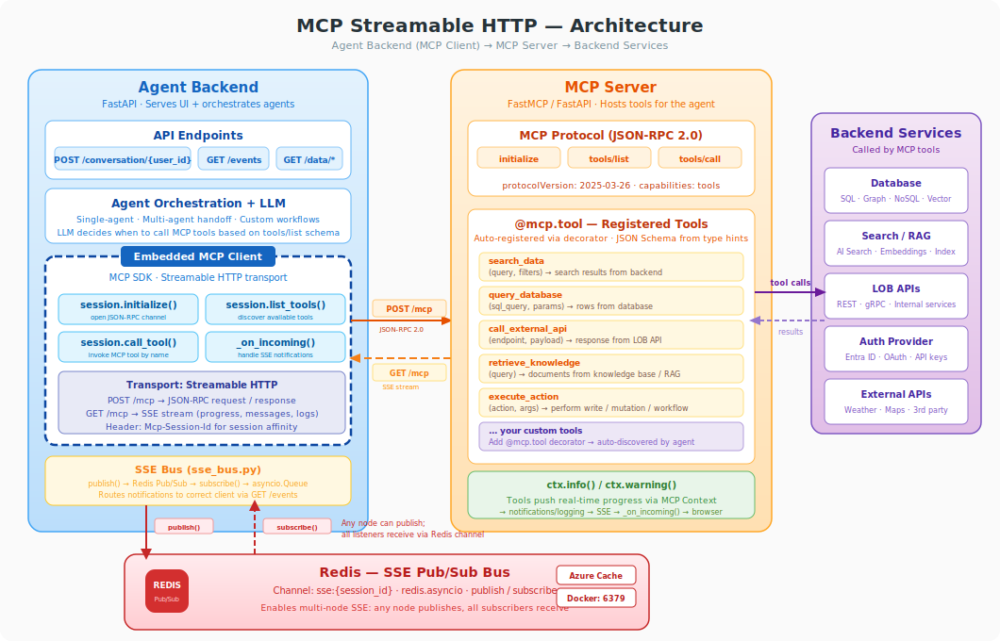
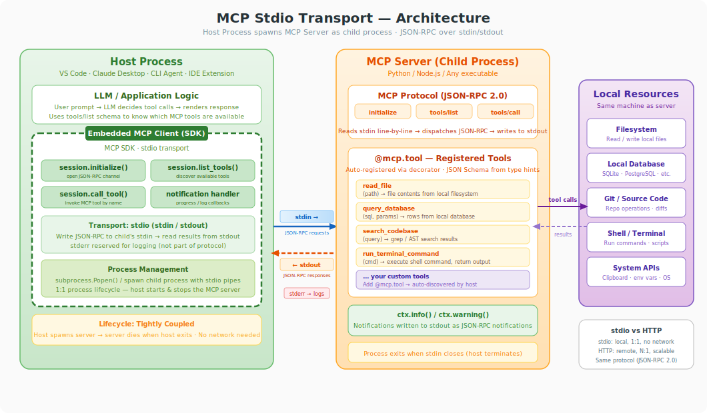

# MCP Server: Streamable HTTP Transport
### Technical Deep-Dive — 10 min

---

## Slide 1: Why Streamable HTTP for Agents?

**The problem**: Agents call tools that take seconds to minutes (graph queries, API calls, search). Clients need real-time visibility, not just a final answer.

**Streamable HTTP (MCP 2025-03-26)** solves this with a single `/mcp` endpoint that supports:

| Capability | How |
|---|---|
| **Request/Response** | `POST /mcp` — standard JSON-RPC call, immediate result |
| **Server → Client streaming** | `GET /mcp` — SSE channel for progress & notifications |
| **Session affinity** | `Mcp-Session-Id` header tracks per-user state |
| **Session cleanup** | `DELETE /mcp` — tear down resources |

> **Key insight**: One URL, three HTTP methods, full duplex communication without WebSockets.

---

## Slide 2: Architecture — Where It Fits



**Speaker note**: The MCP Client is *embedded* in the agent backend — it's not in the browser. The browser talks HTTP/SSE to the agent backend; the agent backend talks MCP to the MCP server.

---

## Slide 3: Real-Time Streaming Agent Use Cases

### Why streaming matters for agentic workloads

1. **Long-running graph queries** — Cypher over PostgreSQL/AGE can take 5-30s; push progress % as rows are scanned
2. **Multi-step tool chains** — Agent calls tool A then tool B; surface intermediate results immediately
3. **Human-in-the-loop** — Push "I'm about to delete 200 records — confirm?" before tool completes
4. **Live status dashboards** — Show which tool is active, what stage, estimated completion

### Example: `analyze_graph_statistics` — a streaming-native tool

A single tool that counts nodes per label, edges per type, and computes a summary — pushing each result line to the browser as it's computed:

```python
@mcp.tool
async def analyze_graph_statistics(
    graph_name: Annotated[str, "Graph name to analyze"],
    ctx: Context = None,
) -> dict:
    """Analyze graph statistics with real-time progress streaming."""
    await ctx.info(f"Starting analysis of graph '{graph_name}'...")
    stats = {"node_counts": {}, "edge_counts": {}, "total_nodes": 0, "total_edges": 0}

    # Step 1 — count nodes per label (each ctx.info streams to browser)
    await ctx.info("Step 1/3: Counting nodes per label...")
    for row in node_rows:
        stats["node_counts"][lbl] = cnt
        await ctx.info(f"  → {lbl}: {cnt:,} nodes")      # ← live in the UI

    # Step 2 — count edges per relationship type
    await ctx.info("Step 2/3: Counting edges per relationship type...")
    for row in edge_rows:
        stats["edge_counts"][rel] = cnt
        await ctx.info(f"  → {rel}: {cnt:,} edges")       # ← live in the UI

    # Step 3 — summary
    await ctx.info(f"Step 3/3: {stats['total_nodes']:,} nodes, {stats['total_edges']:,} edges ✓")
    return stats
```

**Why this is the best fit for demonstrating streaming:**

- Each `await ctx.info()` streams a line to the browser in real-time via SSE — you'll see "→ Person: 142 nodes", "→ Meeting: 87 nodes" ticking in live
- Natural 3-step progression (nodes → edges → summary) visible in the UI
- Zero new dependencies, uses the existing `pg_helper` and `_strip_agtype`
- The LLM can call it with just a `graph_name` — trivial to trigger ("analyze the graph", "show me graph stats")

### Notification types flowing over SSE

```
notifications/progress   →  { progressToken: "cypher_q1", progress: 0.65 }
notifications/message    →  { level: "info", data: [{ type: "text", text: "Found 42 nodes" }] }
notifications/logging    →  { level: "warning", data: { msg: "Slow query detected" } }
```

**Speaker note**: These are *server-initiated*. The MCP server pushes them at any time during tool execution — no polling required.

---

## Slide 4: The `/mcp` Endpoint — Three Methods, One URL

### `POST /mcp` — JSON-RPC Request/Response

```http
POST /mcp HTTP/1.1
Content-Type: application/json
Mcp-Session-Id: user-abc-123

{
  "jsonrpc": "2.0",
  "id": 1,
  "method": "tools/call",
  "params": {
    "name": "get_current_weather",
    "arguments": { "city": "Seattle", "units": "metric" }
  }
}
```

**Response** (immediate):
```json
{
  "jsonrpc": "2.0",
  "id": 1,
  "result": {
    "content": [{ "type": "text", "text": "{\"city\":\"Seattle\",\"temperature\":12.3}" }]
  }
}
```

### `GET /mcp` — SSE Notification Stream

```http
GET /mcp HTTP/1.1
Accept: text/event-stream
Mcp-Session-Id: user-abc-123
```

Returns an open SSE connection. Server pushes progress/message events as tools execute.

### `DELETE /mcp` — Session Teardown

```http
DELETE /mcp HTTP/1.1
Mcp-Session-Id: user-abc-123
```

Returns `204 No Content`. Cleans up in-memory session queues.

---

## Slide 5: JSON-RPC Method Router — Server Implementation

```python
# mcp_fastapi_server.py — the entire protocol in one match statement

@app.post("/mcp")
async def mcp_post(req: Request, tasks: BackgroundTasks):
    req_json   = await req.json()
    session_id = _normalize_session_id(req.headers.get("Mcp-Session-Id"))
    method     = req_json.get("method")
    rpc_id     = req_json.get("id")

    match method:
        case "initialize":
            result = {
                "protocolVersion": "2025-03-26",
                "serverInfo": {"name": "fastapi-mcp", "version": "0.1"},
                "capabilities": {"tools": {"listChanged": True, "callTool": True}},
            }

        case "tools/list":
            result = {"tools": REGISTERED_TOOLS}

        case "tools/call":
            tool_name = req_json["params"]["name"]
            raw_args  = req_json["params"].get("arguments", {})
            raw_out   = await call_tool(tool_name, raw_args, tasks, session_id)
            result    = _ensure_calltool_result(raw_out)

        case _:
            return JSONResponse(content={"jsonrpc": "2.0", "id": rpc_id,
                "error": {"code": -32601, "message": "method not found"}})

    return JSONResponse(
        content={"jsonrpc": "2.0", "id": rpc_id, "result": result},
        headers={"Mcp-Session-Id": session_id},
    )
```

**Speaker note**: This is a *complete* MCP server. It's ~50 lines of Python. No SDK required on the server side — just FastAPI + pattern matching.

---

## Slide 6: Tool Registration — Zero-Config via `@tool` Decorator

```python
# tools.py — auto-register with a decorator

REGISTERED_TOOLS: list[dict] = []     # ← served by tools/list
TOOL_FUNCS: dict[str, Callable] = {}  # ← called by tools/call

def tool(fn):
    """Decorator: inspect signature → build JSON Schema → register."""
    sig = inspect.signature(fn)
    REGISTERED_TOOLS.append({
        "name": fn.__name__,
        "description": inspect.getdoc(fn).splitlines()[0],
        "inputSchema": _schema_from_signature(sig),
    })
    TOOL_FUNCS[fn.__name__] = fn
    return fn
```

### Define a tool — that's it:

```python
@tool
async def get_current_weather(
    city: str,
    country: str | None = None,
    units: Literal["metric", "imperial"] = "metric",
) -> WeatherResult:
    """Get current weather for a city."""
    lat, lon, place = await _geocode(city, country)
    # ... call Open-Meteo API ...
    return WeatherResult(city=place["name"], temperature=cur["temperature_2m"], ...)
```

**What happens at startup**: Python decorator fires → `inspect.signature` extracts params → JSON Schema generated → appended to `REGISTERED_TOOLS`.

**Speaker note**: Adding a new tool is: write a function, add `@tool`. No config files, no manifests.

---

## Slide 7: `tools/list` — What the Client Sees

**Request:**
```json
{ "jsonrpc": "2.0", "id": 2, "method": "tools/list" }
```

**Response:**
```json
{
  "jsonrpc": "2.0", "id": 2,
  "result": {
    "tools": [
      {
        "name": "get_current_weather",
        "description": "Get current weather for a city.",
        "inputSchema": {
          "type": "object",
          "properties": {
            "city":    { "type": "string" },
            "country": { "type": "string" },
            "units":   { "type": "string" }
          },
          "required": ["city"]
        }
      }
    ]
  }
}
```

The LLM uses this schema to decide *when* and *how* to call the tool. It's the same shape as OpenAI function-calling schemas.

---

## Slide 8: `tools/call` + Streaming Notifications — Full Flow

```
  MCP Client                    MCP Server                    External API
      │                              │                              │
      │  POST /mcp tools/call        │                              │
      │  { name: "weather",          │                              │
      │    args: { city: "SEA" } }   │                              │
      │ ────────────────────────▶    │                              │
      │                              │  publish_progress(0.1)       │
      │  ◀──── SSE: progress 10% ── │                              │
      │                              │  httpx.get(geocode_api)      │
      │                              │ ────────────────────────▶    │
      │                              │ ◀────────────────────────    │
      │                              │  publish_progress(0.5)       │
      │  ◀──── SSE: progress 50% ── │                              │
      │                              │  httpx.get(forecast_api)     │
      │                              │ ────────────────────────▶    │
      │                              │ ◀────────────────────────    │
      │                              │  publish_message("Found it") │
      │  ◀──── SSE: message ─────── │                              │
      │                              │                              │
      │  ◀── JSON-RPC result ─────── │                              │
      │  { content: [...weather] }   │                              │
      │                              │                              │
```

**Dual channel**: `POST` carries the request and final result. `GET` (SSE) carries all intermediate status *during* execution.

---

## Slide 9: SSE Bus — Redis Pub/Sub for Multi-Node SSE

### The problem with in-memory queues

In a multi-node deployment (e.g. Azure Container Apps with 3 replicas), the browser's `GET /events` SSE connection lands on **Node A**, but `POST /conversation` may be routed to **Node B**. In-memory `asyncio.Queue` only works within a single process — messages published on Node B never reach Node A.

### Solution: Redis Pub/Sub

```python
# sse_bus.py — Redis-backed pub/sub per session

import redis.asyncio as aioredis

REDIS_URL = os.getenv("REDIS_URL", "redis://localhost:6379/0")

class Session:
    def __init__(self, session_id: str):
        self.q: asyncio.Queue[str] = asyncio.Queue()  # local delivery
        self._pubsub = None  # Redis subscription

    async def start_listening(self):
        r = await _get_redis()
        self._pubsub = r.pubsub()
        await self._pubsub.subscribe(f"sse:{self.session_id}")
        # Background task pumps Redis messages → local queue
        self._listener_task = asyncio.create_task(self._listen_loop())

class SessionManager:
    async def publish(self, session_id: str, msg: str):
        r = await _get_redis()
        await r.publish(f"sse:{session_id}", msg)  # all nodes receive
```

### How it flows

```
Node B: publish_progress()  →  redis.publish("sse:user-123", msg)
                                       │
                               Redis Pub/Sub channel
                                       │
Node A: Session._listen_loop()  ←  subscription receives msg
        → self.q.put(msg)
        → GET /events yields msg to browser
```

**Key design**: `publish()` goes to Redis (any node can call it). Each SSE listener subscribes to its session's Redis channel and relays to a local `asyncio.Queue`. The `GET /events` generator reads from the local queue — zero change to the endpoint code.

**Config**: Set `REDIS_URL` env var. Defaults to `redis://localhost:6379/0`. For Azure: `rediss://:key@host:6380/0`.

---

## Slide 10: MCP Client Side — Connecting from the Agent Backend

```python
# mcp_client.py — embedded in the agent backend

class MCPClient:
    async def connect(self, session_id: str):
        headers = {"Mcp-Session-Id": session_id}

        # Open Streamable HTTP transport (JSON-RPC + SSE)
        read, write, _ = await streamablehttp_client(
            url=self.mcp_endpoint, headers=headers
        )

        # Create JSON-RPC session with notification handler
        self.session = ClientSession(
            read, write,
            message_handler=self._on_incoming   # ← receives SSE notifications
        )
        await self.session.initialize()
        self.mcp_tools = await self.session.list_tools()

    async def _on_incoming(self, msg):
        """Route server notifications to the UI's SSE bus."""
        if isinstance(msg, types.ServerNotification):
            notif = parse_notification_json(msg)
            if isinstance(notif, ProgressNotification):
                await self._broadcast_progress(notif.params.progress, ...)
            elif isinstance(notif, MessageNotification):
                await self._broadcast_assistant(notif.params.data, ...)
```

**Speaker note**: The `message_handler` callback is the *glue* — MCP server notifications → SSE bus → browser. This gives the user real-time visibility into what the agent's tools are doing.

---

## Slide 11: Session Lifecycle — End to End

```
 Browser              Agent Backend (8080)           MCP Server (3000)
    │                        │                              │
    │ 1. GET /events?sid=X   │                              │
    │ ◀══ SSE connection ═══ │                              │
    │                        │  2. connect(session_id=X)    │
    │                        │  ──── POST /mcp initialize ─▶│
    │                        │  ◀─── { protocolVersion }    │
    │                        │  ──── POST /mcp tools/list ─▶│
    │                        │  ◀─── { tools: [...] }       │
    │                        │                              │
    │ 3. POST /conversation  │                              │
    │ ──────────────────────▶│  4. LLM decides to call tool │
    │                        │  ──── POST /mcp tools/call ─▶│
    │                        │                              │ 5. Tool runs...
    │ ◀══ SSE: progress ════ │  ◀══ SSE: progress 50% ════ │ publish_progress()
    │ ◀══ SSE: message ═════ │  ◀══ SSE: "Found 42 nodes" ═│ publish_message()
    │                        │  ◀─── JSON-RPC result        │ 6. Tool done
    │ ◀── NDJSON chunk ───── │                              │
    │ ◀── NDJSON done ────── │  7. POST /mcp DELETE ───────▶│ 8. Cleanup
    │                        │                              │
```

**3 hops**: Browser → Agent Backend → MCP Server, but all streaming. User sees real-time progress at every stage.

**Multi-node**: Redis Pub/Sub ensures SSE notifications reach the correct browser even when `POST /conversation` and `GET /events` hit different nodes.

---

## Slide 12: Key Takeaways

| Aspect | Design Choice |
|---|---|
| **Transport** | Streamable HTTP — no WebSockets, works through proxies/APIM/Dapr |
| **Protocol** | JSON-RPC 2.0 over `POST /mcp`, SSE over `GET /mcp` |
| **Tool registration** | `@tool` decorator → auto JSON Schema from Python type hints |
| **Streaming** | Tools `publish_progress()` / `publish_message()` mid-execution |
| **Session model** | `Mcp-Session-Id` header → Redis Pub/Sub channel per session |
| **Multi-node SSE** | Redis Pub/Sub (`sse:{session_id}`) — any node publishes, all listeners receive |
| **Lifecycle** | `initialize` → `tools/list` → `tools/call` × N → `DELETE /mcp` |
| **No SDK needed (server)** | Pure FastAPI + `match` statement — ~50 lines for the protocol |

### One more thing...

Adding a new tool to the system:

```python
@tool
async def search_knowledge_base(query: str) -> dict:
    """Search the knowledge base using agentic retrieval."""
    results = await azure_ai_search(query)
    return {"content": [{"type": "text", "text": json.dumps(results)}]}
```

That's it. The agent discovers it automatically via `tools/list`.

---

*Repo: `mcp_server/mcp_fastapi_server.py` · `mcp_server/tools.py` · `af_fastapi/sse_bus.py` (Redis Pub/Sub) · `af_fastapi/mcp_client.py`*

---
---

# Appendix: MCP Stdio Transport
### Architecture & Use Cases

---

## Stdio Slide 1: What is Stdio Transport?

**Stdio** is the *original* MCP transport — the host spawns the MCP server as a **child process** and communicates via **stdin/stdout** pipes using the same JSON-RPC 2.0 protocol.

| Aspect | Stdio | Streamable HTTP |
|---|---|---|
| **Connection** | stdin/stdout pipes (local) | HTTP + SSE (network) |
| **Deployment** | Same machine, 1:1 process | Remote, N:1 scalable |
| **Session model** | Implicit (one pipe = one session) | `Mcp-Session-Id` header |
| **Startup** | Host spawns child process | Client connects to URL |
| **Lifecycle** | Tightly coupled — dies with host | Independent service |
| **Network** | Not required | Required |
| **Protocol** | JSON-RPC 2.0 (identical) | JSON-RPC 2.0 (identical) |

> **Key insight**: The protocol layer (initialize → tools/list → tools/call) is *identical*. Only the transport differs. A tool written for stdio works over HTTP with zero changes.

---

## Stdio Slide 2: Architecture — How Stdio Fits



**Speaker note**: The host process (VS Code, Claude Desktop, CLI agent) starts the MCP server as a child process. JSON-RPC requests go to the child's stdin, responses come back on stdout. stderr is used for debug logging only — it's not part of the protocol. No network stack involved.

---

## Stdio Slide 3: Stdio Use Cases

### 1. IDE Extensions (VS Code, Cursor, Windsurf)

The most common stdio use case. The IDE spawns MCP servers as child processes to give the AI assistant access to:
- **Filesystem** — read/write project files
- **Terminal** — run build commands, tests, linters
- **Git** — commit, diff, branch operations
- **Language servers** — type checking, refactoring

```json
// .vscode/mcp.json
{
  "servers": {
    "filesystem": {
      "command": "npx",
      "args": ["-y", "@modelcontextprotocol/server-filesystem", "./src"]
    }
  }
}
```

### 2. Claude Desktop — Local Tool Access

Claude Desktop uses stdio to connect to MCP servers running on the user's machine:
- **Database queries** — query local SQLite/PostgreSQL without exposing ports
- **Browser automation** — Puppeteer/Playwright for web scraping
- **File management** — organize, rename, search local files

```json
// claude_desktop_config.json
{
  "mcpServers": {
    "sqlite": {
      "command": "uvx",
      "args": ["mcp-server-sqlite", "--db-path", "./data/analytics.db"]
    }
  }
}
```

### 3. CLI Agents & Scripts

Lightweight agents that spawn MCP servers for specific tasks:
- **CI/CD pipelines** — spawn a code-analysis MCP server, run checks, terminate
- **Data processing** — spawn a database MCP server, run queries, collect results
- **One-shot automation** — scaffolding, migrations, bulk operations

```python
# CLI agent spawning stdio MCP server
async with stdio_client(
    StdioServerParameters(command="python", args=["my_mcp_server.py"])
) as (read, write):
    session = ClientSession(read, write)
    await session.initialize()
    tools = await session.list_tools()
    result = await session.call_tool("analyze_code", {"path": "./src"})
```

### 4. Development & Testing

Stdio is the fastest way to iterate on MCP tools:
- **No server setup** — just run the Python/Node script
- **Direct debugging** — attach debugger to the child process
- **Unit testing** — pipe JSON-RPC in, assert JSON-RPC out

---

## Stdio Slide 4: Stdio Session Lifecycle

```
  Host Process                     MCP Server (child process)
      │                                      │
      │  1. subprocess.Popen(                │
      │     "python mcp_server.py",          │
      │     stdin=PIPE, stdout=PIPE)         │
      │  ═══════ process spawned ═══════▶    │
      │                                      │
      │  2. stdin: initialize                │
      │  ─────────────────────────────────▶  │
      │  ◀──────── stdout: { version }       │
      │                                      │
      │  3. stdin: tools/list                │
      │  ─────────────────────────────────▶  │
      │  ◀──────── stdout: { tools: [...] }  │
      │                                      │
      │  4. stdin: tools/call                │
      │  ─────────────────────────────────▶  │
      │  ◀──── stdout: notification ──────   │  (ctx.info / progress)
      │  ◀──── stdout: notification ──────   │  (more progress)
      │  ◀──────── stdout: { result }        │
      │                                      │
      │  5. Host closes stdin / exits        │
      │  ═══════ process terminates ════▶    │
      │                                      │
```

**Key difference from HTTP**: Notifications and results share the **same stdout stream** (newline-delimited JSON-RPC). In HTTP, notifications go over SSE (`GET /mcp`) while results come back on the `POST /mcp` response.

---

## Stdio Slide 5: When to Use Which Transport

| Scenario | Use Stdio | Use Streamable HTTP |
|---|---|---|
| IDE / desktop AI assistant | ✅ | |
| Local dev tools (filesystem, git, shell) | ✅ | |
| Quick prototyping & testing | ✅ | |
| Multi-user web application | | ✅ |
| Microservice / container deployment | | ✅ |
| Tools behind a firewall / API gateway | | ✅ |
| Long-running server with multiple clients | | ✅ |
| CI/CD pipeline (ephemeral) | ✅ | |
| Need load balancing / horizontal scaling | | ✅ |

### Decision rule

> **Local + single user → stdio.** Remote + multi-user → Streamable HTTP. Same tools work in both — just swap the transport.

### Hybrid pattern

Many production setups use **both**: stdio during development (fast iteration), then deploy the same tools over Streamable HTTP for production (scalable, multi-user).

```python
# Same server code, two transports:
mcp = FastMCP("my-server")

@mcp.tool
async def analyze_data(query: str, ctx: Context = None) -> dict:
    """Works identically over stdio or HTTP."""
    if ctx: await ctx.info("Analyzing...")
    return {"result": "..."}

# Dev:  mcp.run(transport="stdio")
# Prod: mcp.run(transport="streamable-http", host="0.0.0.0", port=3000)
```

---

*Same protocol. Same tools. Different transport. Pick what fits your deployment.*
